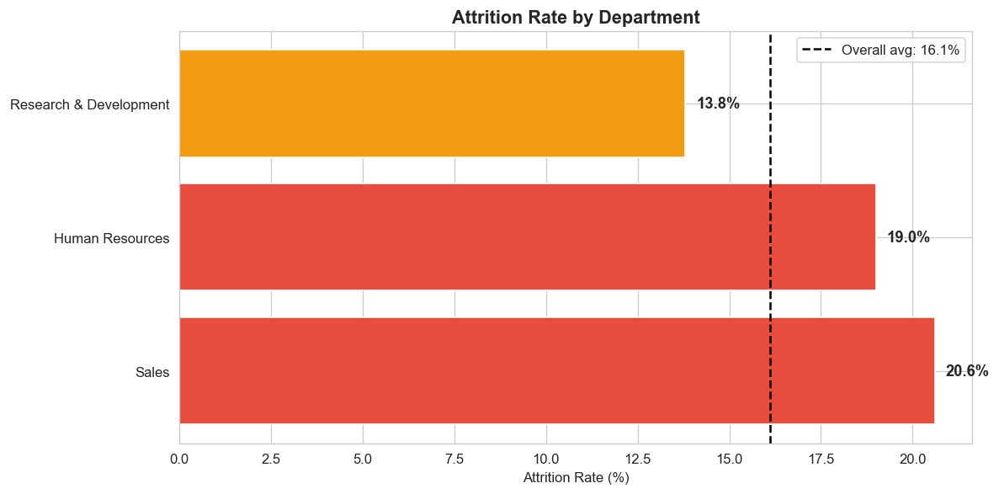

# 📊 HR Attrition Analysis — Employee Retention Insights

## 🔍 Problem Statement

A company is facing employee attrition, leading to increased hiring costs,
loss of productivity, and disruption in operations.

The goal of this project is to identify **why employees are leaving** and
provide actionable insights to improve retention strategies.

> *"Employees don’t leave companies. They leave poor management, low pay, and bad work-life balance."*

---

## 🛠️ Tools Used

| Tool                                 | Purpose                                      |
| ------------------------------------ | -------------------------------------------- |
| Python (Pandas, Matplotlib, Seaborn) | Data cleaning, EDA, ML modelling             |
| MySQL                                | Business queries, structured data analysis   |
| Power BI                             | Interactive dashboard, business presentation |

---

## 📁 Project Structure

```
hr-attrition-analysis/
│
├── hr_attrition_phase1.ipynb        # Python EDA and analysis
├── hr_attrition_phase2.ipynb # Machine Learning (Models & Predictions)
├── hr_attrition_queries.sql           # SQL queries for business insights
├── hr_attrition_dashboard.pbix        # Power BI dashboard
│
├── chart1_attrition_overview.png      # Overall attrition distribution
├── chart2_department_attrition.png    # Attrition rate by department
├── chart3_overtime_attrition.png      # Overtime impact on attrition
├── chart4_income_attrition.png        # Salary vs attrition
├── chart5_satisfaction_attrition.png  # Job satisfaction impact
├── chart6_confusion_matrix.png        # ML evaluation
├── chart7_roc_curve.png               # Model comparison
├── chart8_feature_importance.png      # Key drivers
├── chart9_risk_distribution.png       # Risk segmentation
├── Dashboard Screenshot.png           # Full Power BI dashboard
│
└── README.md
```

---

## 📊 Dataset

* **Source:** IBM HR Analytics Dataset (Kaggle)
* **Size:** 1,470 employees | 35 columns
* **Key columns:** Age, MonthlyIncome, JobRole, Department, OverTime, JobSatisfaction

---

## 🔎 Key Findings

### 1. 🎯 Overall Attrition Problem

Out of 1470 employees:

* Employees Left: **237**
* Attrition Rate: **16.12%**

👉 Indicates a moderate attrition issue requiring attention

---

### 2. 🏢 Department Analysis

* Sales → **Highest attrition (~20.6%)**
* Human Resources → ~19%
* Research & Development → **Lowest (~13.8%)**

👉 Sales department faces highest employee churn

---

### 3. ⏱️ Overtime Impact (CRITICAL)

Employees working overtime are significantly more likely to leave:

| Overtime | Attrition Rate |
| -------- | -------------- |
| No       | 10.4%          |
| Yes      | **30.5%**      |

👉 Overtime increases attrition by **~3x**

---

### 4. 💰 Salary Impact

Attrition decreases as salary increases:

| Salary Range     | Attrition Rate |
| ---------------- | -------------- |
| Low (0–3K)       | **28.6%**      |
| Medium (3–6K)    | ~12.7%         |
| High (6–10K)     | ~12.0%         |
| Very High (10K+) | **8.9%**       |

👉 Low salary is a major driver of attrition

---

### 5. 😊 Job Satisfaction Impact

* Low satisfaction → **22.8% attrition**
* Medium → ~16.4%
* High → ~16.5%
* Very High → **11.3%**

👉 Employee satisfaction strongly affects retention

---

### 6. ⚠️ High-Risk Employees

Employees most likely to leave:

* Work overtime
* Earn low salary
* Have low job satisfaction
* Early in their career

---

## 🤖 Machine Learning Analysis

Models Used:

* Logistic Regression
* Random Forest

---

## 📊 Model Performance

* Logistic Regression AUC: 0.804
* Random Forest AUC: 0.784

👉 Logistic Regression performs slightly better overall

---

## 📉 Confusion Matrix Insights

* Logistic Regression: Better balance
* Random Forest: High accuracy but misses some attrition cases

---

## 🔥 Feature Importance (Top Drivers)

Monthly Income
Age
Total Working Years
Salary Per Experience
Years at Company

👉 Compensation + experience = strongest factors

## ⚠️ Risk Segmentation

Employees categorized into:

* 🔴 Critical Risk
* 🟠 High Risk
* 🟡 Medium Risk
* 🟢 Low Risk

👉 Enables proactive HR intervention

---

## 💡 Business Recommendations

1. Reduce excessive overtime workload
2. Improve employee engagement programs
3. Increase salary for low-income employees
4. Focus on retention of early-stage employees
5. Monitor high-risk employees proactively

---

## 📈 Dashboard Preview

### Full Dashboard


### Department Attrition



---

## 🐍 Python Analysis — What Was Done

* Data cleaning & preprocessing
* Feature engineering (salary slabs, age groups)
* Exploratory Data Analysis
* ML model building (Logistic + Random Forest)
* Model evaluation (Confusion Matrix, ROC Curve)
* Feature importance analysis
* Risk scoring system

---

## 🗄️ SQL Analysis — Key Queries

* Overall attrition calculation
* Department-wise attrition
* Overtime impact analysis
* Salary bracket analysis
* Job satisfaction analysis
* Risk profiling queries
* Multi-dimensional analysis

---

## 📊 Power BI Dashboard

* KPI Cards (Attrition Rate, Total Employees)
* Department Analysis
* Job Role Insights
* Gender & Age Group Analysis
* Salary Analysis
* Interactive slicers

---

## 🚀 How to Run This Project

### Python

```bash
pip install pandas matplotlib seaborn jupyter
jupyter notebook
# Open hr_attrition_phase1.ipynb
```

---

### SQL

```sql
-- Open MySQL Workbench
-- Run hr_attrition_queries.sql
```

---

### Power BI

```
Open hr_attrition_dashboard.pbix in Power BI Desktop
Use slicers to filter by Department and Job Role
```

---

## 👤 About Me

I am an aspiring Data Analyst skilled in Python, SQL, and Power BI.
This project demonstrates my ability to analyze real-world HR data
and generate actionable business insights.

---

*Dataset sourced from IBM HR Analytics (Kaggle)*
